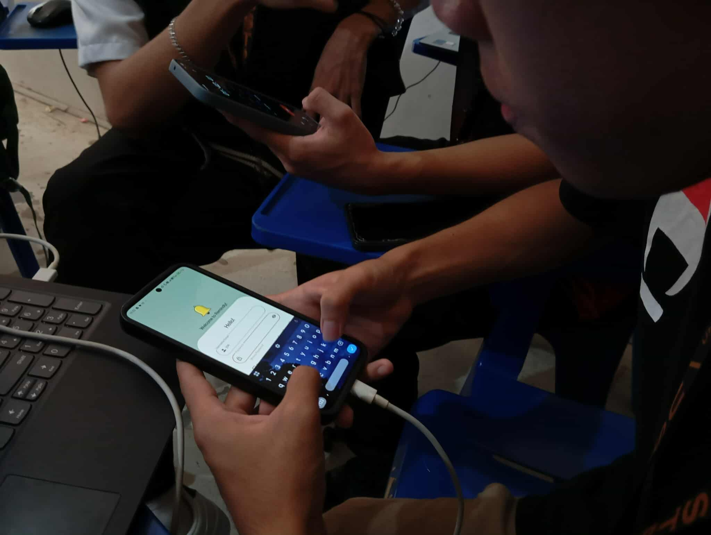

# Remindly – Login / Sign-Up Flow Prototype (Android Studio)

This project is the official output for the **Sixth Laboratory Activity**, developed by **Team Mothy**.  
It features a fully interactive, high-fidelity Login and Sign-Up flow built using **Android Studio (Java + XML)**.  
The prototype simulates a complete authentication experience including registration, login, validations, navigation, and error states.

____________________________________________________________________________

## Team Mothy — Members & Roles
| **Joshua Aquino**            | UI/UX Designer 
| **Carl Jazzel Bologa**       | Lead Developer 
| **Timothy Ceballos**         | Project Manager 
| **Paul Ello**                | Product Manager 
| **Angelo Vens Recopelacion** | Logistics & Assistant UI/UX 
_____________________________________________________________________________

## Technologies Used
- **Android Studio (Java)**
- **XML Layouts**
_____________________________________________________________________________
##  Project Overview
The app provides a complete **Login and 3-Step Sign-Up flow** with consistent UI, validation, and interactive navigation.
___________________________________
## **1. Login Screen**
- Email/Username field  
- Password field  
- Login button  
- “Forgot Password” link  
- “Create an Account” link  
- **Error State:** Invalid Credentials  
___________________________________
## **2. Multi-Step Sign-Up Flow (3 Screens)**

### **Step 1 – Basic Details**
- Username  
- Email  
- Field validation  

### **Step 2 – Security Setup**
- Password  
- Confirm Password  
- **Error State:** Password Mismatch  
- Password validation rules  

### **Step 3 – Final Confirmation**
- “Create Account” button  
- On success → returns to Login screen  
___________________________________
## **3. Success State**
After successful registration or login, users are redirected to a simple **Welcome Dashboard Screen**.
___________________________________

## Screenshots

|    Screen      |    Preview 
|--------------- |---------
| **Sign-In**    |  
| **Sign-Up**    | 
| **ForgotPass** | 
___________________________________

## How to Run the App
Follow the steps below to run the project in Android Studio:

## 1. Clone or Download the Repository
You can get the project in two ways:

**Option A — Clone using Git:**
Open your terminal and run:
git clone https://github.com/your-username/your-repo-name.git

**Option B — Download ZIP:**
Go to the GitHub repository
Click Code → Download ZIP
Extract the ZIP file to your computer

## 2. Open the Project in Android Studio
Launch Android Studio
Click Open
Select the project folder you cloned or extracted
Wait for Android Studio to load all files

## 3. Allow Gradle to Sync
Android Studio will automatically:
Sync Gradle
Build the project
Download dependencies
If a prompt appears, select “Use default Gradle wrapper”.

## 4. Run the Application
Connect a physical Android device or start an Android Emulator
Click the Run ▶ button on the top toolbar
Select your device
The app will build, install, and launch automatically

## 5. You're All Set!
You can now explore the full prototype:
- Login Screen
- 3-Step Sign-Up Flow
- Error Validations
- Success / Welcome Screen
## Documentations

